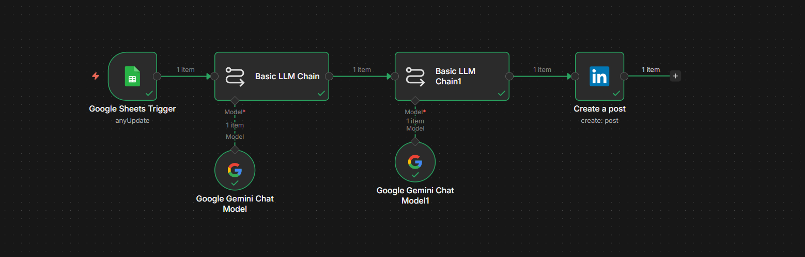

# 🤖 AI-Powered LinkedIn Content Automation

> An AI-powered workflow built with **n8n** and **Google Gemini** to automate LinkedIn content creation and publishing.

## 🚀 About the Project

This project automates the process of creating and publishing LinkedIn content from a news/article link.

A link is added to **Google Sheets**, and the n8n workflow processes it using **Google Gemini** to generate content and then publishes the final post automatically to LinkedIn.

## 🔄 Workflow

```text
📰 Article / News Link
        ↓
📊 Google Sheets
        ↓
⚡ n8n Workflow
        ↓
🤖 Google Gemini
        ↓
📝 AI-Generated LinkedIn Post
        ↓
💼 LinkedIn
        ↓
🚀 Published Automatically
```

## 🛠️ Technologies Used

* **n8n** — Workflow automation
* **Google Sheets** — Input source
* **Google Gemini** — AI content generation
* **LinkedIn** — Automatic publishing

## ⚙️ How It Works

1. Add a news/article link to Google Sheets.
2. The n8n workflow detects the update.
3. Google Gemini analyzes the provided information.
4. Gemini generates a concise summary.
5. A second AI step converts the summary into a professional LinkedIn post.
6. The generated post is automatically published to LinkedIn.

## 📸 Workflow Preview



## 🎯 What I Learned

Through this project, I gained hands-on experience with:

* Building automation workflows using n8n
* Integrating Google Gemini into workflows
* Connecting multiple platforms together
* Working with AI-generated content
* Automating repetitive tasks
* Understanding workflow and API-based integrations

## 📚 Learning Journey

I built this project as part of my learning journey with **NxtWave**.

The goal was to take what I learned about AI and workflow automation and turn it into a working project.

This project helped me understand how different tools can be connected together to create a practical end-to-end automation.

## 🔮 Future Improvements

* 🖼️ Add AI-generated images to LinkedIn posts
* 🚫 Prevent duplicate article posts
* ⏰ Add scheduled posting
* 📊 Track published posts in Google Sheets
* ✨ Improve content personalization

## ⚠️ Note

The workflow JSON included in this repository is a **sanitized portfolio version**. Credentials and private account information have been removed.

To run the workflow, users need to configure their own Google Sheets, Google Gemini, and LinkedIn credentials in n8n.

## 👨‍💻 About Me

I'm currently learning and building projects around **AI, automation, and technology**.

This is one of my first hands-on automation projects, and I'm excited to keep learning and building more. 🚀
